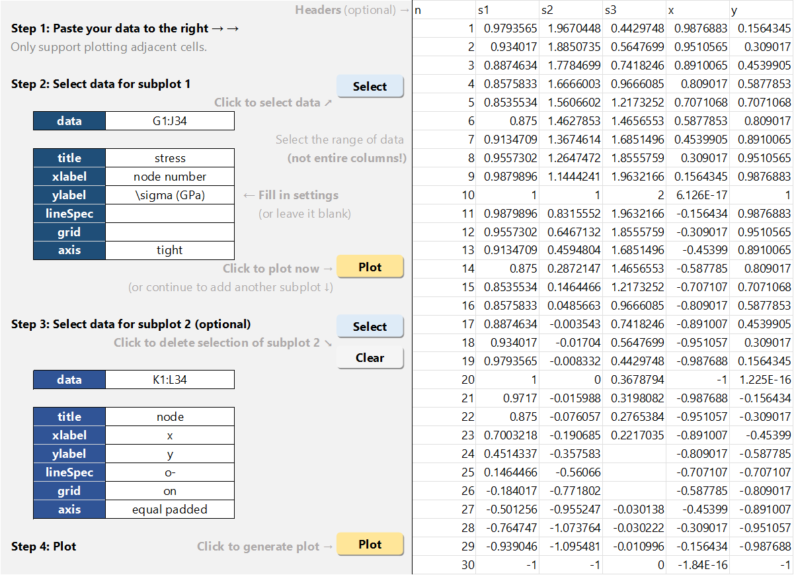
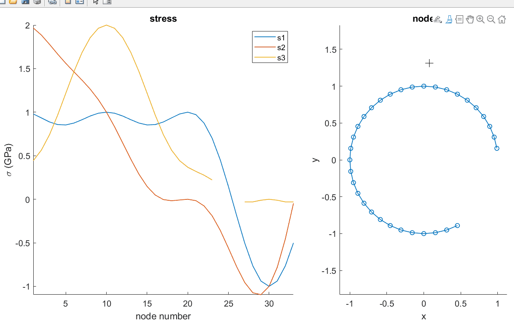
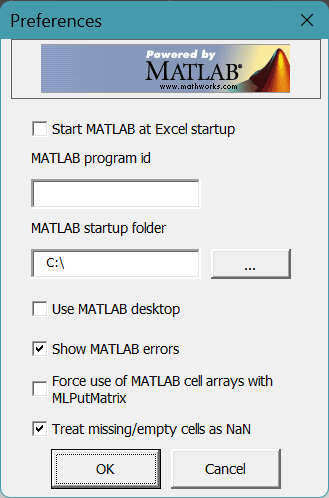

# Easy MATLAB Plot with Excel

Plot data in a Excel file with MATLAB featuring:

- Easy plotting by pasting data into Excel spreadsheet and clicking buttons

- Linked brush tools between subplots

Download release v1.0 [here](https://github.com/MlHsieh/easy-excel-plot/releases).

Screenshot:

Generated matlab figure:

## Requirements

1. **OS**: Windows.

2. **MATLAB**:
   
   - **Version**: *R2019b* or newer.
   
   - **Toolbox**: Spreadsheet Link (for Microsoft Excel)  
     Spreadsheet Link™ connects Microsoft® Excel® spreadsheet software with the MATLAB® workspace, enabling you to access the MATLAB environment from an Excel spreadsheet.

3. Enable macros of `Plot.xlsm` in Excel. See instructions on [Microsoft Support](https://support.microsoft.com/en-us/office/enable-or-disable-macros-in-microsoft-365-files-12b036fd-d140-4e74-b45e-16fed1a7e5c6).

## Install and setup Spreadsheet Link toolbox

1. Follow the [documentation](https://www.mathworks.com/help/exlink/installation.html) to install Spreadsheet Link.

2. To enable the Spreadsheet Link add-in, start a Microsoft Excel session and follow the steps in the [documentation](https://www.mathworks.com/help/exlink/add-in-setup-1.html).

3. Open the **Preferences** dialog of Spreadsheet Link from **MATLAB** group on the top right of **Home** tab of Ribbon.

 

4. Modify the following settings:
   
   1. Change "**MATLAB startup folder**" to where `PlotColumns.m` is located.
   
   2. Enable the option "**Treat missing/empty cells as NaN**", as shown above.

   Other settings:

- **Start MATLAB at Excel start up**:  
  Kind of annoying. I recommend disable this option. However, if this option is disabled, you must start MATLAB manually in **Excel** before plotting. MATLAB sessions not launched by Excel cannot be used to run macro with Spreadsheet Link.
  To start MATLAB manually: Click **MATLAB** group on the top right of the **Home** tab in your Excel worksheet and click **Start MATLAB**.

- **MATLAB program id**:  
  Specifies the MATLAB version to open when Spreadsheet Link starts in Microsoft Excel.

- **Use MATLAB desktop**:  
  Launch MATLAB with full gui or command line only, default is command line only.

- **Force use of MATLAB cell arrays with MLPutMatrix**:  
  Enable this option might cause some trouble if your data do not have headings.
5. You might need to update the references in `Plot.xslm`:
   
   1. Open `Plot.xslm` with Microsoft Excel
   
   2. open the Visual Basic® Editor window by clicking **Visual Basic** on the **Developer** tab. (If you do not find the **Developer** tab, see the Excel Help.)
   
   3. In the left pane, select a module for which you want to update a
      reference.
   
   4. From the main menu, select **Tools** > **References**.
   
   5. In the References dialog box, select the **SpreadsheetLink** check box.
   
   6. Click **OK**.
